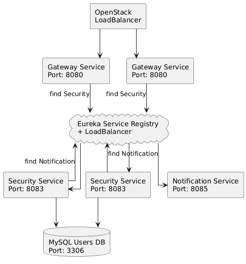
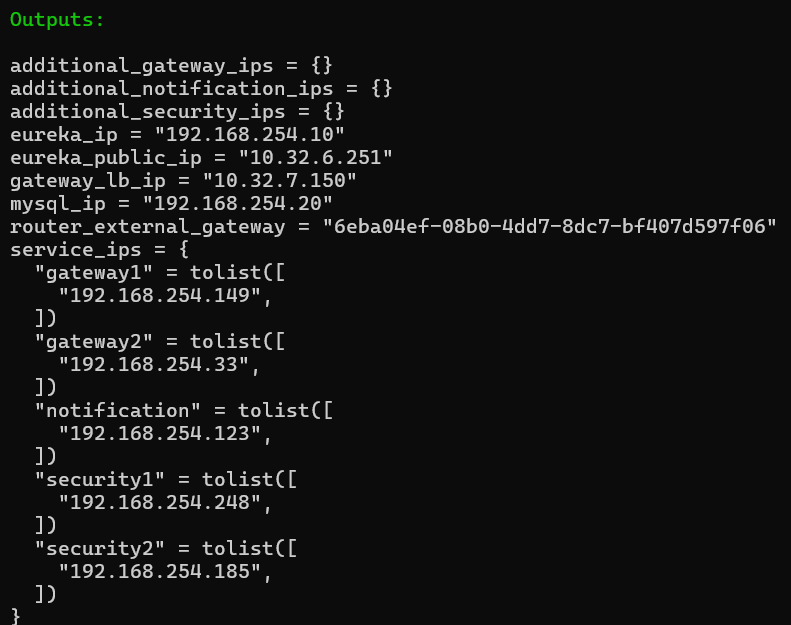
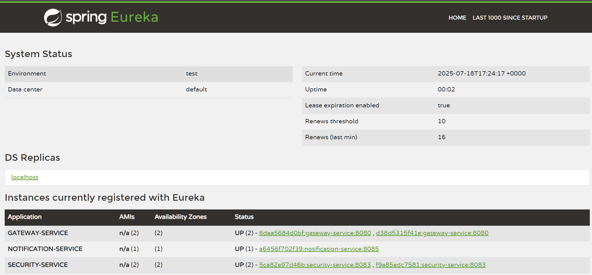

# OpenStack Microservice Realisation using Terraform

[](https://openjdk.java.net/projects/jdk/17/)
[](https://spring.io/projects/spring-boot)
[](https://docs.docker.com)
[]((https://developer.hashicorp.com/terraform))

## 📋 Overview

The *OpenStack Microservice Realisation using Terraform* is a comprehensive cloud infrastructure automation platform designed for scalable microservices deployment on OpenStack. This system enables DevOps engineers and cloud architects to deploy, manage, and auto-scale enterprise-grade microservice architectures through Infrastructure as Code (IaC) principles, automated provisioning, and intelligent load balancing.

### 🎯 Key Features

- **☁️ Infrastructure as Code:** Complete OpenStack infrastructure provisioning using Terraform
- **🚀 Manual-Scaling Architecture:** Scaling of Gateway, Security, and Notification services
- **⚖️ Load Balancing:** Automated load balancer configuration with health monitoring
- **🔐 Service Discovery:** Eureka-based service registry for microservice communication
- **🗄️ Database Management:** MySQL database provisioning with persistent storage
- **🌐 Network Automation:** Automated network, subnet, and security group configuration
- **📊 Monitoring & Health Checks:** Built-in health monitoring for all services
- **🔧 Modular Design:** Reusable Terraform modules for different service types
- **🛡️ Security Groups:** Comprehensive firewall rules and network security

## 👥 Team CloudComputing - 7

**Course**: Cloud Computing - Global Software Development  
**Institution**: Hochschule Fulda  
**Teacher**: Prof. Dr. Sebastian Rieger

### Team Members

| Name | Role |
|------|------|
| **Egor Busuioc** | Backend Developer |
| **Dmitrii Zalevskii** | Backend Developer |
| **Iuliia Shtal** | Backend Developer |

## 🏗️ Architecture

The system follows a **microservices architecture** with the following components:



### Services Overview

- **Gateway Service**: API gateway handling routing, load balancing and some security features
- **Security Service**: Authentication, JWT management, user registration, reset password functionality
- **Notification Service**: Email notifications for password resets

## 🚀 Getting Started

### Prerequisites

- **Terraform** installed
- **SSH key** must be created in the main directory (my-terraform-key)
- **OpenStack Credentials** configured

### Quick Launch

#### Windows
```bash
# Initialisation .terraform
terraform init
terraform plan

# Start all services
terraform apply
```
#### After this command initialisation we predict to have




### Upscaling and Downscaling

#### How it Works?
```bash
# You can upscale every microservice
terraform apply -var="additional_gateway_count=1" -var="additional_notification_count=1" -var="additional_security_count=2"

# After this command, the following will be automatically upscaled: 1 gateway, 1 notification service, and 2 security services.
# They will be automatically registered in the Eureka server, and the gateway will also be added to the OpenStack Load Balancer.

# Of course, you can also do this:
terraform apply -var="additional_gateway_count=1"

# To destroy your additional services, you should set the count to 0 or simply omit the variable:
terraform apply -var="additional_gateway_count=0" -var="additional_notification_count=0" -var="additional_security_count=0"

terraform apply
# These commands are equivalent
```

### Difficulties and Their Solutions

#### Non-functioning LoadBalancer
Initially, the **OpenStack LoadBalancer** was not working due to several reasons — the security group on the gateway did not allow requests, and the endpoint itself did not exist.
The issue was resolved by adding the **Spring Actuator dependency** and allowing access to this endpoint for everyone.

#### Static and Dynamic IP Addresses
In this implementation, **Static IP** addresses are used for **Eureka and MySQL.**
This was done so that the other servers know where to send their requests (Eureka), and to ensure that the security server can connect to its database.
Of course, this could be passed through Docker, but for security reasons, we chose this method for now.
Dynamic IP addresses are used for all other servers.

### Testing

You can test our microservices in three different ways:

```bash
# Check the OpenStack LoadBalancer
# For more accurate testing, it is recommended to use Postman

http://<loadbalancer_floating_ip>/check

# This endpoint updates the server IP after refreshing.
# Expected output: Gateway is running on IP: 192.168.254.33

# Check the Eureka LoadBalancer
http://<loadbalancer_floating_ip>/auth/test-ip

# This endpoint updates the server IP after refreshing.
# Expected output: You're accessing the security-server with IP: 192.168.254.248

# Registration endpoints are also available, but for their usage it is recommended to visit the Swagger page at:
http://<loadbalancer_floating_ip>/swagger-ui/index.html

# There you can test Register, Login, and Reset-Password functionality
```

### What about the realisation?

#### Docker Images and Docker Hub
For fast deployment and quick startup, I uploaded the images to Docker Hub — specifically to `busuiocegor/cloud-project`.  
From there, the images are pulled each time, and containers are created from them with their own operating systems, enabling fast and seamless startup of the required service.

#### Convenience
All of this is designed for quick setup — even by people who may not fully understand how everything works.  
You just need to run a script, and everything will work.  
Of course, using Kubernetes would automate many things, but for this implementation, everything is done clearly and consistently.

### Note

If you have any questions, please contact:  
Egor Busuioc: egor.busuioc@informatik.hs-fulda.de  
Iuliia Shtal: iuliia.shtal@informatik.hs-fulda.de  
Dmitrii Zalevskii: dmitrii.zalevskii@informatik.hs-fulda.de  
